<!--
  SETUP NOTES (delete this comment block when done):
  1. Upload header.svg to the root of this profile repo so the image below resolves.
  2. Rename your GitHub account to a professional handle (Settings > Account > Change username),
     e.g. clarenceneilmeneses - old links redirect automatically. Then replace every
     "Clarensyoooooo" below with the new handle.
  3. Replace the two repo links in Featured Work with your actual repository URLs,
     and make sure those repos have a README with screenshots (use dummy data only
     for the PDAO project - never real constituent records).
-->

  

    

  
  
  

 

## About

I build practical systems end-to-end - from database schema to deployed product to the dashboard that explains it. As the sole developer for a city government office, I designed, built, and turned over a client management portal that digitized 2,000+ paper records, then delivered an inventory system and automated BI reporting pipeline for a private firm during my internship.

BS Information Technology, Major in Business Analytics - Batangas State University, 2026. Google-certified in Analytics and Ads Measurement.

## Featured Work

<!-- Replace the repo URLs below with your actual repositories -->

| Project | What it does | Stack |
|---|---|---|
| **[PDAO Client Management & Analytics Portal](https://github.com/Clarensyoooooo/pdao-portal)** | Government system that replaced a fully paper-based record office. Digitized 2,000+ constituent records, cut record retrieval from ~20 minutes to under 1 minute, and maps demographics across 30 barangays with a GIS module. Delivered with zero critical defects at turnover after 100+ test cases and UAT. | PHP · MySQL · REST API · GIS |
| **[Inventory Management System + BI Dashboard](https://github.com/Clarensyoooooo/inventory-bi)** | Internal system tracking 500+ SKUs with automated low-stock alerts and role-based access, paired with a Power BI dashboard fed by SQL queries that turned hours of weekly manual reporting into on-demand insight. | PHP · MySQL · Power BI · SQL |
| **[Portfolio](https://clarencemeneses.vercel.app/)** | Personal site with project case studies and write-ups. | HTML · CSS · JavaScript |

## Tech Stack

**Core - what I ship with**

  
  
  
  
  
  
  

**Data & Analytics**

  
  
  
  

**Tools**

  
  
  
  

**Currently exploring**

  
  
  
  

## GitHub Activity

  
  

 

  Open to junior full-stack and data analyst opportunities · Batangas / Remote

